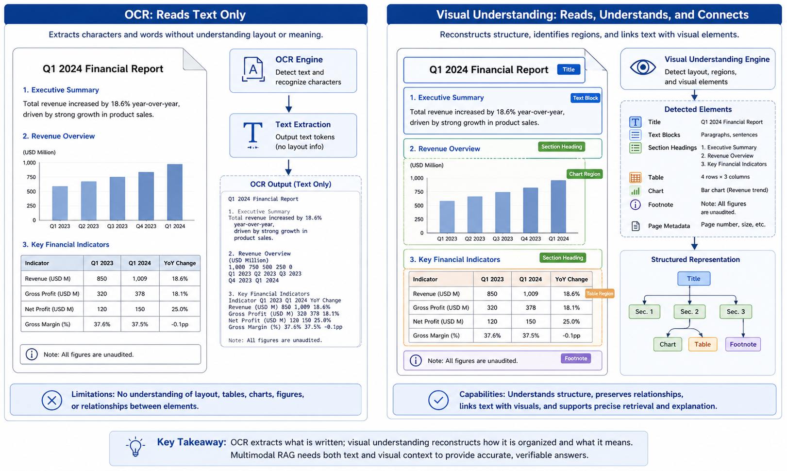
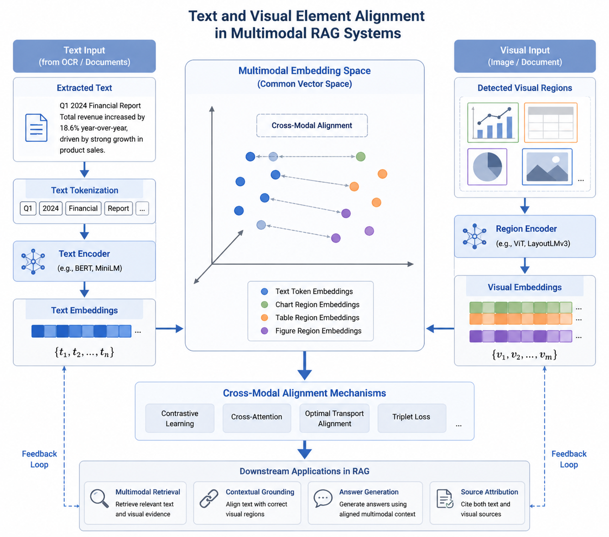
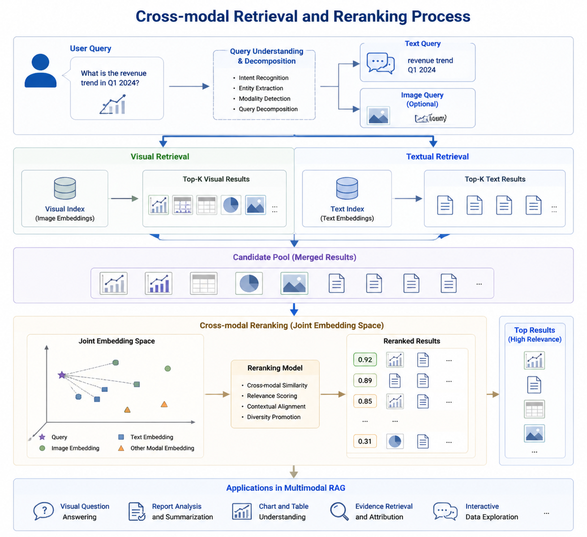
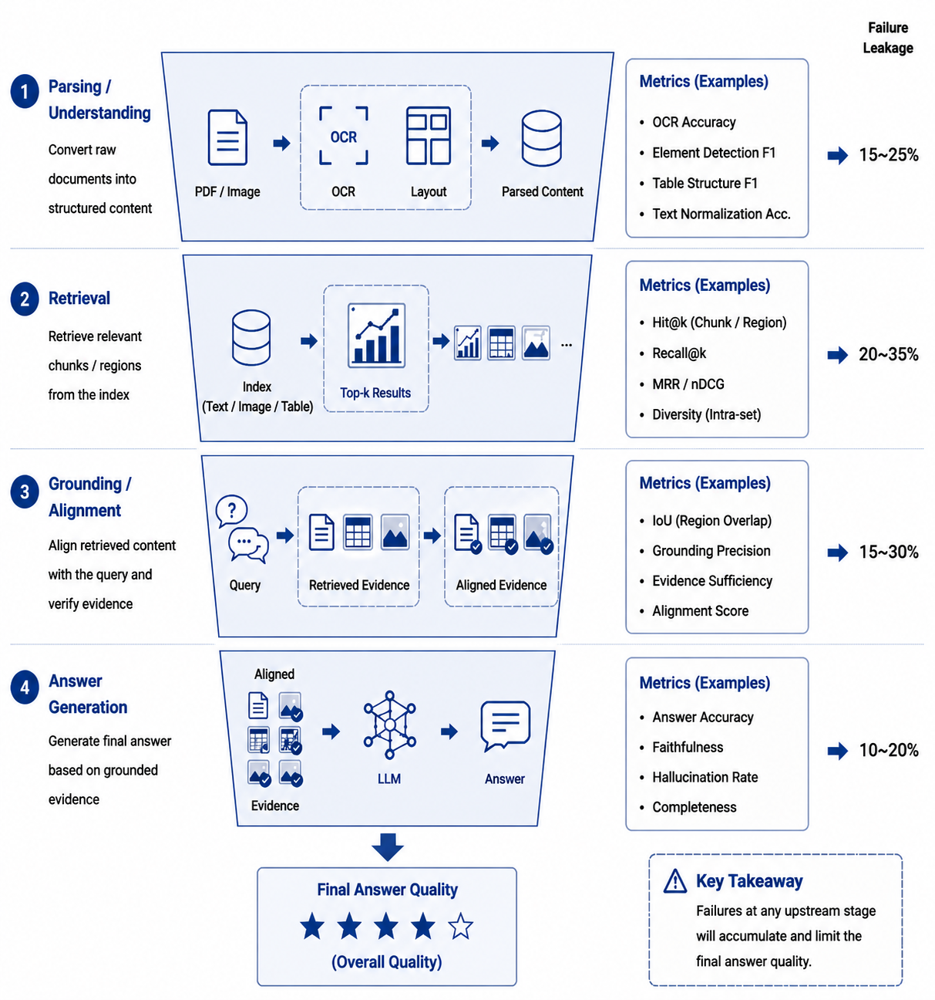
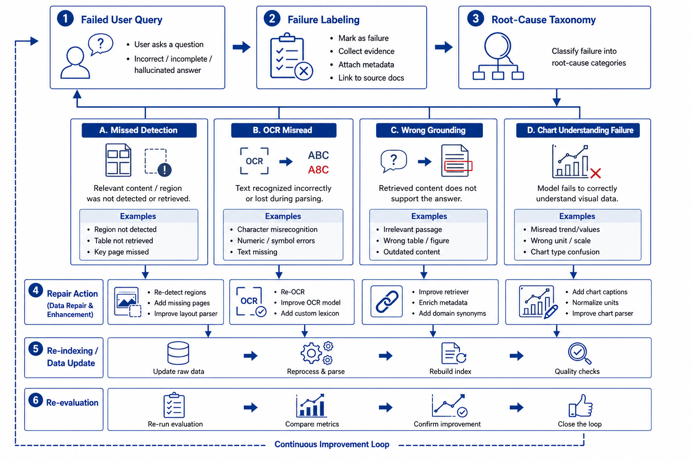

# Chapter 22: Multimodal RAG and Visual Retrieval

As RAG systems have expanded from text-centric scenarios such as enterprise knowledge Q&A, policy retrieval, and document assistants into financial-report analysis, contract review, product-manual understanding, invoice processing, medical-imaging reports, and Q&A over complex-layout documents, a new problem has come to the fore: real-world knowledge does not always exist as plain text. A large amount of critical information is hidden inside images, tables, charts, screenshots, flowcharts, layout structures, and visual regions. If a system continues to follow the text-RAG playbook, simply parsing documents into strings and then chunking, embedding, and retrieving, it will easily fail systematically in complex knowledge scenarios.

The fundamental assumption of text RAG is that knowledge can be turned into text and that retrieval plus generation over that text is sufficient for Q&A. In multimodal scenarios, this assumption does not always hold. For example, a key trend in a financial report may be conveyed in a line chart; the operating steps in a product manual may depend on the position of a button in a screenshot; the seals and annotations on a scanned contract may exist only as images; and the judgment basis in a medical-examination report may emerge from the combined relationship between an image region and its textual description. In such cases, OCR can extract only part of the text and cannot fully express visual structure, spatial relationships, or image–text alignment.

The core task of multimodal RAG is therefore not "adding OCR to text RAG," but redefining what counts as a knowledge unit and how indexing and evidence organization are designed. The system needs to understand the relationships among pages, regions, objects, tables, images, and text, and to organize this multimodal information into knowledge assets that are retrievable, locatable, citable, and verifiable. In other words, the problem that multimodal RAG is solving is not "how to convert images into text," but "how to bring visual knowledge into the retrieval-and-generation loop."

This chapter focuses on multimodal RAG and visual retrieval. It centers on why text RAG cannot cover visual knowledge, how visual chunks and object models should be designed, how cross-modal indexing, retrieval, and reranking work, and how evaluation, error attribution, and the backfilling of online failure samples continually improve system capability on complex documents. This chapter also lays a methodological foundation for the subsequent projects on multimodal financial-report assistants, complex enterprise-document retrieval, and document understanding.

---

## 22.1 Why Text RAG Cannot Cover Visual Knowledge

### 22.1.1 From Readable Text to Understandable Pages

In Chapter 21 we discussed how a RAG data pipeline is organized around document engineering: from raw-document ingestion, parsing, and structured cleaning, to chunk construction, indexing, retrieval, evaluation, and feedback. For text-dominant knowledge bases, this pipeline can already solve a large number of practical problems. However, when knowledge appears in the form of complex pages, charts, images, or layout structures, relying solely on text extraction quickly runs into clear bottlenecks.

The core processing unit in text RAG is the text segment. The system typically first parses the document into text, then splits chunks based on paragraphs or semantic boundaries, and finally retrieves relevant content via vector search and keyword search. The implicit premise is that the original knowledge can be largely converted into linear text. But knowledge in complex documents is often non-linear: it is spatial, structured, and cross-modal.

For instance, in a financial report, information such as "revenue growth," "declining gross margin," and "cash-flow changes" is often not expressed by a single paragraph but distributed across body text, tabular data, bar charts, line charts, and footnotes. Extracting body text alone may lose chart trends; extracting tables alone may lose interpretive context; running OCR over chart text alone cannot capture curve dynamics. For a user question like "what were the main reasons for the decline in the company's Q2 profit margin," the system must retrieve textual explanations, key financial tables, and related charts simultaneously, rather than recalling a single paragraph.

As another example, a step in a product-operation manual may say "click the Advanced Settings button in the upper right," while the actual position, icon shape, and surrounding layout of that button exist only in a screenshot. If the system extracts only text, it may obtain the phrase "Advanced Settings button" but cannot understand where the button sits on the page, and it cannot answer "where is the Advanced Settings button" or "what other options are next to that button." The answer lies in the visual layout, not just in the text.

Multimodal RAG therefore requires us to shift from a "readable text" perspective to an "understandable page" perspective. A page is no longer just a text container; it is a knowledge structure jointly composed of text blocks, image blocks, table blocks, chart regions, layout relationships, and visual objects. The system must process not only textual content but also the spatial, referential, and semantic relations among these elements.

---

### 22.1.2 OCR Is Not Visual Understanding

A common misconception in multimodal RAG projects is treating OCR as a substitute for visual understanding. The role of OCR is to recognize text in images; it solves the problem "what does the text in this image say." Visual understanding, however, must solve a more complex set of problems: where these texts are located, which visual elements they relate to, which table, chart, or region they belong to, what relationships exist among them, and how they jointly support an answer.

Take a scanned financial report as an example. OCR can recognize words and numbers on the page, such as "Revenue," "Gross Margin," "2023," "2024," "15.6%," and so on. But these tokens alone are not enough to answer questions. The system must also know which row and column a given number belongs to, what its unit is, whether it comes from a merged cell, whether it is constrained by a footnote, and whether it corresponds to a particular chart trend. If OCR output is simply concatenated into text, the original visual structure is destroyed and the model sees only a jumble of strings.

Similarly, for chart-type knowledge, OCR can recognize axis labels and legend entries but struggles to directly understand curve trends, bar comparisons, area changes, or outliers. If a user asks "in which quarter was revenue growth fastest," the answer is often not literally written on the page but must be inferred from the chart's visual form. The system therefore needs visual-region detection, chart-type recognition, data extraction, and cross-modal alignment, not just OCR.

For screenshot-type knowledge, OCR is likewise insufficient. Buttons, menus, input fields, icons, and tooltips in a software interface jointly form operational semantics. Whether a button is clickable, which region it belongs to, and which input field it is associated with are usually determined by the visual layout. OCR can recognize the button's label but cannot fully express interaction relationships. If the system relies on OCR alone, it may produce the button name yet fail to guide the user through the operation.

In multimodal RAG, OCR is therefore only a foundational capability, not a complete solution. Genuine visual understanding requires handling at least four types of information simultaneously: textual content, visual regions, spatial layout, and cross-modal relationships. Only when this information is organized into a unified knowledge representation can the system answer questions reliably over complex documents and visual scenes.

*Figure 22-1: Capability boundary between OCR and visual understanding*

---

### 22.1.3 Three Typical Forms of Visual Knowledge

To understand the data-engineering challenges of multimodal RAG, it helps to first divide visual knowledge into three categories: document-layout knowledge, chart-numeric knowledge, and interface/scene-object knowledge. Different categories impose different requirements on parsing, chunking, indexing, and evaluation.

The first category is document-layout knowledge. It appears mainly in PDFs, scanned documents, contracts, reports, manuals, and invoices. Its defining feature is that knowledge depends on page layout and structural hierarchy. The relationship between a heading and its body text, between a table and its footnotes, between a figure caption and its image, and between a phrase like "as shown in the table below" and the table that follows all fall under document-layout knowledge. For this category, the system's priority is not recognizing individual objects but restoring page structure and reading order.

The second category is chart-numeric knowledge. It appears in earnings reports, experimental reports, business dashboards, market analyses, and statistical charts. Its defining feature is that knowledge is not expressed as sentences but encoded visually, through bar heights, line-chart trends, color groupings, axis ticks, and legend mappings. For this category, the system must convert charts into structured data or chart-semantic descriptions; otherwise, accurate Q&A is hard to support.

The third category is interface and object knowledge. It appears in software screenshots, operating manuals, industrial images, product photos, and on-site photographs. Its defining feature is that knowledge depends on object positions, visual attributes, and spatial relationships. Expressions like "the button in the upper-right corner," "the red warning icon," "the Submit button below the form," or "the port on the left side of the device" can only be understood with reference to the visual region. For this category, the system needs object detection, region description, and visual-object alignment.

*Table 22-1: Main forms of visual knowledge and their processing focus*

| Visual knowledge type            | Common sources                                | Core information                                              | Processing focus                                          |
| -------------------------------- | --------------------------------------------- | ------------------------------------------------------------- | --------------------------------------------------------- |
| Document-layout knowledge        | PDFs, scans, contracts, reports               | Heading hierarchy, paragraphs, tables, captions, page numbers | Layout parsing, reading order, region localization        |
| Chart-numeric knowledge          | Earnings reports, statistical reports, dashboards | Axes, legends, trends, numerical relations                | Chart recognition, data extraction, trend description     |
| Interface and object knowledge   | Software screenshots, manuals, product images | Buttons, icons, regions, object relations                     | Object detection, region description, spatial relations   |
| Image–text association knowledge | Mixed image–text documents, manuals           | Body references, captions, visual evidence                    | Image–text alignment, captions, citation binding          |

This table shows that multimodal RAG is not a single task but a set of data-engineering problems centered on organizing visual knowledge. Different categories of visual knowledge require different processing strategies. If a system applies the same OCR-plus-text-chunking recipe to all visual knowledge, it will keep hitting its limits in real-world scenarios.

---

### 22.1.4 Typical Failure Modes of Text RAG on Visual Scenarios

When text RAG is applied directly to multimodal documents or visual-knowledge scenarios, the common failure modes fall into four categories: missed reads, misreads, mislocalization, and broken evidence chains.

A missed read means the system fails to capture key information at all. For example, a key metric in a financial report lives in an image-based table; OCR quality is poor or the parser ignores the image region, so the information never enters the knowledge base. Even with otherwise normal retrieval, the system cannot recall knowledge that does not exist in the index.

A misread means the system captures the information but interprets its structure or meaning incorrectly. For instance, when a table is flattened into linear text, the system may associate a number with the wrong field; chart-axis ticks may be misread, leading to incorrect trend judgments; the reading order of a multi-column page may be scrambled, splicing together two unrelated paragraphs. Misreads are more dangerous than missed reads because the system will produce plausible-looking answers from incorrect evidence.

Mislocalization means the system knows the relevant content exists but cannot pin down the exact page or visual region. For instance, the system answers "this data comes from Figure 3" but cannot say which curve, bar, or table cell within Figure 3 it refers to. This reduces verifiability and makes users distrust the system.

A broken evidence chain means the connection between text and visual evidence is lost. For example, the body text states "as shown in Figure 4, the model's performance degrades under high load," but after parsing the body-text chunk and the Figure 4 image chunk are not linked. The system may recall the body text but not the image; or it may recall the OCR text of the image but fail to associate it with the body-text explanation. In either case, the model cannot use the evidence as a whole.

What these failure modes share is that the original knowledge has not entirely disappeared—it has simply not entered the retrieval system in the right structure. They reinforce the point that the key to multimodal RAG is not bolting on a vision model but redesigning the data representation, indexing, and evidence organization of visual knowledge.

---

### 22.1.5 A Paradigm Shift from Text Chunks to Visual Chunks

The basic unit of text RAG is the text chunk; in multimodal RAG, this unit must be extended to the visual chunk. A visual chunk is not simply a single image; it is a knowledge unit equipped with a visual region, text content, spatial position, semantic description, source information, and citation anchors.

In a financial-report PDF, for example, a visual chunk can be a full page, a table region, a chart, a footnote area, or a body paragraph combined with the chart it refers to. For a software-operation manual, a visual chunk can be a screenshot region together with its accompanying explanation. For a scanned contract, a visual chunk can be a seal area, an annotation area, or a table region.

A visual chunk should contain at least the following information: the image or page region itself, region coordinates, OCR text, a visual description, associated text, the page it belongs to, the chapter path, the content type, permission information, and citation anchors. For chart-type chunks, it should also include the chart type, axes, legend, extracted data, and a trend summary. For table-type chunks, it should include row–column structure, units, and notes.

This means the schema of knowledge units in multimodal RAG is more complex than in text RAG. It must support not only text retrieval but also image retrieval, region localization, cross-modal reranking, and answer traceability. At generation time, the system must tell the model not only "what this text says" but also "what this visual region represents, which texts it relates to, and where the user can verify it."

From this perspective, the fundamental change in multimodal RAG is that the knowledge unit expands from a one-dimensional text fragment to a two- or even multi-dimensional evidence object. This requires data engineering to upgrade from "text chunking" to "page modeling" and "visual-object modeling."

---

### 22.1.6 Section Summary

This section discussed why traditional text RAG cannot fully cover visual knowledge. The fundamental reason is that a large portion of real-world knowledge does not exist as linear text but is embedded in page layouts, chart structures, screenshot regions, object positions, and image–text relations. OCR can extract text from images, but it cannot replace visual understanding because it cannot fully restore spatial structure, visual relationships, or cross-modal semantics.

The core challenge of multimodal RAG is to organize visual knowledge into knowledge units that are retrievable, locatable, citable, and verifiable. This requires the system to move from text chunks to visual chunks, from text-only indexes to cross-modal indexes, and from "finding relevant text" to "finding usable visual evidence."

The next section discusses visual chunks and object modeling, focusing on how page-level, region-level, object-level, and table-level chunks should be designed, and how bounding boxes, layout, captions, and OCR text can be organized into a unified multimodal knowledge representation.

---

## 22.2 Visual Chunks and Object Modeling

### 22.2.1 Basic Concepts and Challenges of Visual Chunks

In a multimodal RAG system, how to understand and process visual information is a critical engineering question. Traditional text RAG systems build retrievable knowledge units by splitting documents into multiple text fragments (chunks) that typically rely on structured textual content such as paragraphs, tables, or sentences. In visual scenarios, however, knowledge does not always appear as simple text fragments—especially in settings that contain images, tables, charts, QR codes, complex layouts, or scanned documents.

Visual-information processing is therefore not just about extracting text from images (i.e., OCR); it also means understanding the structure of the image itself, the spatial relationships among objects, and effectively aligning and fusing these visual elements with textual information. This leads to the concept of a "visual chunk." A visual chunk is a basic visual unit extracted from an image—it may be a chart region, a picture, a table, or any visual object with semantic meaning. Like a text chunk, a visual chunk should carry its semantic content, position information, and associated textual content, so that downstream retrieval, generation, and verification can use it reliably.

#### Core characteristics of visual chunks

- **Diversity**: A visual chunk can be a picture, chart, table, flowchart, and so on, containing many kinds of visual objects.

- **Spatial relations**: Visual chunks have spatial relations to one another—chart axes, object positions in an image, the row–column arrangement of tables, and so on.

- **Text association**: Many visual chunks contain content related to text, such as the title and data of a table, or the labels and trends of a chart.

- **Cross-modal alignment**: Visual chunks need to be aligned with the corresponding text to form a joint cross-modal representation suitable for downstream retrieval and generation.

  ------

  

### 22.2.2 Methods for Generating and Modeling Visual Chunks

In a real RAG system, generating visual chunks involves several key steps: object detection, region segmentation, OCR extraction, and semantic labeling of visual regions. These steps work together so the system can identify the important visual elements in an image and create appropriate knowledge-unit representations for them.

#### Object detection and region segmentation

Object detection is an important computer-vision task in multimodal systems: it identifies different objects in an image and assigns class labels. In a RAG system, object detection is typically used to identify visual regions such as charts, pictures, text boxes, and flowcharts.

Region segmentation refines object detection: it not only identifies objects but also delineates their boundaries, marking precise positions. With region segmentation, the system can extract distinct regions from an image and align each region with its corresponding text or metadata.

#### OCR extraction and text extraction

OCR is primarily used to extract textual content from images, helping the system understand the text inside visual regions. In a multimodal RAG system, OCR is not just character-level extraction—it combines image structure, position, and context to extract text. For example, in a financial-statement table image, OCR will recognize the numbers in the table and combine them with the row–column relations of the table to produce structured tabular data.

After OCR extraction, the system also needs to clean and normalize the text: remove noise characters, correct recognition errors, fix formatting issues. In addition, OCR output must be aligned with other visual elements in the image to ensure that text and visual regions match correctly.

#### Semantic labeling of visual regions

To make visual chunks more semantic, the system must add appropriate labels and metadata to each visual region. These labels typically include the image category, the region's function, and the relations to text. For chart-type visual chunks, labels may include "axis," "trend line," and "legend"; for table-type visual chunks, they may include "row header," "column header," and "value cell."

Introducing these labels and metadata not only helps the system understand the content of each visual region but also benefits downstream retrieval and generation. For instance, when a user asks "how does the company's revenue trend look," the system can use labels to identify chart regions related to revenue and return them as evidence to the generation model so that it produces an accurate answer.

---

### 22.2.3 Cross-Modal Alignment: Joint Representation of Text and Vision

Cross-modal alignment is one of the core tasks in a multimodal RAG system: the system must effectively combine and align visual and textual information to produce accurate knowledge representations. Cross-modal alignment is not just concatenating images and text—it is about understanding their relations, interactions, and shared semantics.

#### Methods for aligning text with visual elements

A common alignment method is position-based alignment. Here, the system uses the position information of OCR-extracted text to match it with regions in the image. For a financial-statement image, for instance, the system can use the row–column information of table text to correspond OCR text with each cell region.

Another method is semantic-based alignment. Here, the system considers not only the positional relations between text and visual regions but also their semantic similarity. For example, in a report that contains sales data and a trend chart, the system can identify the semantic link between the text "sales" and the "sales trend" represented in the line chart, and combine them into a complete visual chunk.

#### Joint representation and multimodal retrieval

Joint representation of text and visual information is the ultimate goal of cross-modal alignment. With joint representation, the system can process textual and visual data simultaneously and return integrated information at query time. For instance, when retrieving, a user may simultaneously ask "how did sales trend in Q1 2024" and "which chart contains the sales data." The system must, through joint representation, first identify the relevant sales-trend chart from images and then extract the sales-data description from text, producing a complete final answer.

Joint representation usually relies on multimodal embeddings that map text and visual information into the same vector space. In this space, relations between textual and visual elements are represented by vector distances or similarities, making cross-modal querying and retrieval more efficient.

*Figure 22-2: Joint representation and alignment of textual and visual elements*

---

### 22.2.4 Indexing and Retrieval Strategies for Visual Chunks

In a multimodal RAG system, indexing and retrieving visual chunks differ significantly from traditional text RAG. Visual chunks rely not only on textual semantics but also on image content, chart trends, and spatial relations. The indexing strategy must therefore handle visual features, textual features, and metadata features, and support cross-modal retrieval.

#### Cross-modal indexing: joint indexing of text and vision

Cross-modal indexing means indexing text and visual information together and creating a unified index entry for each visual chunk. The entry contains not only text content but also visual features (chart trends, table data cells, image categories) and metadata (chart type, image size, chart title, etc.). The system can then consider both textual and visual information during retrieval, producing better matches for user queries.

A common cross-modal indexing approach embeds text and images into the same vector space and retrieves by computing similarity between text and visual vectors. Its advantage is that it can flexibly handle information from different modalities and provide rich context for each query.

#### Multimodal retrieval: precise queries combining images and text

Multimodal retrieval uses both text and visual information at query time. For example, a user may input "how did sales trend in Q1 2024" along with a chart image; the system must recognize the chart content and match it with related sales-data descriptions to produce an accurate answer. To achieve this, the system must process textual and visual queries simultaneously and map both into the same retrieval space.

The key to multimodal retrieval is designing an efficient cross-modal matching mechanism so that text and visual information complement each other during retrieval. In practice, the system may first recall relevant content via text retrieval and then refine via image retrieval, finally combining text and images to produce the answer.

---

### 22.2.5 Evaluation and Optimization of Visual Chunks

Evaluation and optimization are key to keeping a multimodal RAG system stable over the long run. In multimodal scenarios, evaluation must focus not only on retrieval accuracy but also on the alignment between visual chunks and text, information completeness, and the credibility of the final generated output.

#### Evaluation metrics: accuracy and usability

Common metrics for evaluating a multimodal RAG system include:

- **Precision and Recall**: assess the system's performance on visual and text retrieval.
- **Context Completeness**: check whether the system provides a complete evidence chain and background information.
- **Generation Accuracy**: assess whether the generated answer is based on correct evidence and is factually accurate.
- **Cross-modal Consistency**: check whether text and visual information are correctly aligned and whether any key information is lost during generation.

#### Optimization strategy: continuous improvement based on evaluation feedback

Optimization of a multimodal RAG system depends on evaluation feedback. The system should continually improve the generation and modeling of visual chunks based on evaluation results. For example, when a chart trend in a visual chunk is inconsistent with the textual description, the system should adjust the chart-recognition and trend-analysis models; when text–visual alignment is weak, the joint-representation method should be improved. In this way, the system can gradually enhance its cross-modal retrieval and generation capabilities as real-world usage evolves.

---

### 22.2.6 Section Summary

This section discussed the generation and modeling of visual chunks in multimodal RAG systems. Through object detection, region segmentation, OCR extraction, and semantic labeling of visual regions, the system can transform images into semantically meaningful visual chunks that provide a solid foundation for downstream retrieval, generation, and traceability. Generating visual chunks depends not only on recognizing image content but also on cross-modal alignment between images and text, which enables accurate multimodal retrieval and generation.

This section also explored cross-modal indexing and retrieval strategies and how evaluation and optimization continually improve system stability and reliability. As multimodal capabilities grow stronger, RAG systems will be able to handle complex documents, reports, charts, images, and tables more comprehensively, producing higher-quality answers.

---

## 22.3 Cross-Modal Indexing, Retrieval, and Reranking

### 22.3.1 Cross-Modal Indexing and Joint Spaces

In a multimodal RAG system, the goal of cross-modal indexing is to manage and retrieve visual and textual data through an effective indexing mechanism. Unlike traditional text RAG, which indexes only text, cross-modal retrieval must handle the relationship between images and text and store/index this information through a joint representation. To achieve this, the system typically embeds images and text into a shared embedding space.

#### Embedding space for images and text

An image–text embedding space is a high-dimensional vector space into which both textual and image features are mapped. In this space, similar textual and visual information receive similar vector representations, so matching and retrieval can be performed by computing distance or similarity between vectors. To produce cross-modal embeddings, dual-stream networks or multimodal embedding models are usually employed.

For instance, text can be encoded by a pretrained language model (such as BERT or RoBERTa) into a vector representing its semantics, while an image can be encoded by a vision model (such as ResNet or ViT) into a vector representing its visual features. The system then maps these two modalities' embedding vectors into the same shared space through joint training or alignment.

#### Advantages of joint spaces

The advantage of a joint space is that it provides a unified framework for cross-modal retrieval. In this space, both images and text are represented as vectors, and similarity computations enable matching. For example, given a text query "Q1 2024 sales growth," the system can simultaneously retrieve, in the joint space, relevant text passages and charts and return the most relevant images and text as results.

In addition, joint spaces support cross-modal reranking. In a multimodal query, a user may supply both an image and text; the system computes similarity between text and image in the joint space and reorders the combined results to improve retrieval precision.

---

### 22.3.2 Visual Recall, Text Recall, and Cross-Modal Reranking

In cross-modal retrieval, visual recall, text recall, and cross-modal reranking are three crucial stages. The system first extracts query-relevant content via visual and text recall, and then refines the ordering through cross-modal reranking, improving the relevance and accuracy of retrieval results.

#### Visual recall and text recall

Visual recall means retrieving the images most relevant to a given query from a corpus of images. Typically, visual recall is performed by computing similarity between the image embeddings of all images in the library and the query image vector. Image embeddings can be extracted by a vision model (such as ResNet or ViT) and matched against the query's image vector to recall the most relevant images.

Text recall is analogous, except that the recalled data is text. Given a textual query, the system computes similarity between the query's text vector and text vectors in the document library to recall relevant passages or documents. Text embeddings are usually encoded by pretrained language models (such as BERT or GPT) and matched against text vectors in the corpus.

*Table 22-2: Comparison between visual recall and text recall*

| Feature                   | Visual recall                                          | Text recall                                                |
| ------------------------- | ------------------------------------------------------ | ---------------------------------------------------------- |
| Primary information type  | Image content, image features, visual patterns         | Semantic content, vocabulary, text passages                |
| Feature-extraction method | CNNs, vision transformers (ViT)                        | Word embeddings, sentence embeddings (BERT, RoBERTa)       |
| Retrieval method          | Similarity between image embeddings and the query image | Similarity between text embeddings and the query text     |
| Cross-modal fusion        | Visual feature extraction matched to the query         | Semantic extraction associated with text                   |

#### Cross-modal reranking

Cross-modal reranking refines the results of visual and text recall through a second-stage ordering. In multimodal queries, users typically supply both a text query and an image query, and the system must determine the most relevant answer based on both modalities.

Cross-modal reranking primarily relies on image and text embeddings in the joint space. In the initial recall stage, the system recalls text and images separately and uses their union as the candidate set. In the cross-modal reranking stage, the system feeds the image and text embeddings into a reranking model and orders the candidates by their joint similarity. This way, the system can balance the relevance of images and text and improve the accuracy of retrieval results.

*Figure 22-3: Cross-modal retrieval and reranking flow*

---

### 22.3.3 Retrieval Strategies for Complex Documents, Multi-Page Reports, and Chart Q&A

When dealing with complex documents, multi-page reports, or chart-based Q&A tasks, traditional text RAG faces serious difficulties. Because such documents contain multiple modalities (text, tables, images, charts), how to retrieve and generate efficiently is one of the core problems of multimodal RAG. The system must design dedicated retrieval strategies to support efficient fusion of multimodal information.

#### Retrieval strategies for complex documents

Complex documents (long documents, reports, contracts, and so on) usually contain large amounts of information with complex hierarchical structure. In a multimodal RAG system, retrieving such documents requires effectively fusing multimodal information across text, charts, images, and tables. A layered retrieval strategy is advisable: first retrieve text content, and then, based on the textual context, look further into charts and images for related evidence. This narrows the retrieval scope and improves efficiency.

#### Retrieval strategies for multi-page reports and chart Q&A

Multi-page reports and chart-based Q&A typically require the system to process multiple pages and chart data simultaneously. The system must implement cross-modal alignment between image regions and text and combine information at the page, region, and chart levels for retrieval. During querying, the system can intelligently identify relevant pages, charts, and table regions based on the query context and provide answers quickly.

For chart-Q&A tasks, the system must pay special attention to the relationship between charts and text. For example, in a financial report a passage may describe a data trend shown in a chart; the system must align chart and text and use data points from the chart to generate the final answer. This requires processing images and text simultaneously and effectively fusing the relevant information across both.

#### Joint retrieval of tabular and chart data

In complex documents that contain both tables and charts, joint retrieval of tabular and chart data is especially important. Traditional text retrieval systems often ignore data points and trends in charts, but chart-Q&A systems must design cross-modal indexing and retrieval to support joint retrieval of tabular and chart data. At query time, the system needs to combine numerical data and textual descriptions from tables and charts to generate accurate answers.

---

### 22.3.4 Section Summary

This section explored key issues in cross-modal retrieval, including image embeddings, text embeddings, and the construction of joint spaces. By embedding text and images into the same vector space, the system can process multimodal queries jointly and retrieve efficiently. We also introduced the flow of visual recall, text recall, and cross-modal reranking, and how joint-space and reranking strategies can boost retrieval relevance and accuracy.

For retrieval strategies in complex documents, multi-page reports, and chart Q&A, the system must combine text, charts, tables, and image modalities through layered and joint retrieval to provide accurate answers. Looking ahead, cross-modal retrieval will play a major role in complex documents, financial reports, medical imaging, and other multimodal scenarios.

---

## 22.4 Evaluation, Error Attribution, and Data Backfill

### 22.4.1 Why Evaluating Multimodal RAG Cannot Rely on Answer Correctness Alone

In text-RAG projects, many teams put evaluation emphasis on "whether the answer is correct"—using manual scoring, rule-based comparison, or an LLM judge to determine final-answer correctness. While incomplete, this approach usually covers the main issues in pure-text scenarios. In multimodal RAG, however, focusing solely on the final answer easily masks structural defects inside the system.

The reason is that multimodal-RAG failures are typically layered. A wrong final answer may stem from a visual region not being detected, from OCR misreading characters, from a visual chunk never entering the index, from correct candidate recall but cross-modal reranking pushing a distractor chart to the top, or from improperly assembled evidence at generation time. If we only look at "right/wrong," we cannot tell whether the system is stuck at parsing, indexing, retrieval, localization, or generation, and we cannot optimize purposefully.

More importantly, multimodal systems frequently produce answers that "look about right but cite the wrong evidence." If a user asks "what were the main reasons for the company's Q2 2024 gross-margin decline," the system's text explanation may approximate the correct answer, but the cited chart page may be wrong, or Q2 and Q3 data regions may be confused. If evaluation only checks semantic similarity, such cases may be falsely marked correct; but in real business use, these answers cannot pass an audit and cannot build user trust.

Evaluation of multimodal RAG must therefore be upgraded from single-point answer assessment to chain-level evidence assessment. We typically split this into four layers: the parsing layer, focusing on whether pages, regions, tables, and charts are correctly identified; the retrieval layer, focusing on whether relevant pages or regions are recalled; the localization layer, focusing on whether the system can anchor answers to the correct visual evidence; and the generation layer, focusing on whether the answer is faithful to the recalled evidence, complete, and verifiable. Only by observing all four layers simultaneously can optimization gain traction.

From an engineering perspective, this is equivalent to decomposing final-answer quality into a multi-stage quality funnel. For each stage, separate metrics, datasets, and dependency tracking must be defined. With these in place, the team can answer three key questions: in which stage is the problem most visible; whether this issue is a general defect or concentrated in certain document types, chart types, or question phrasings; and whether fixing the current problem will introduce new side effects.

For convenience, we can organize the core multimodal-RAG metrics into a joint scoring framework. Let retrieval hit rate be $R_k$, localization accuracy $L$, answer accuracy $A$, and evidence consistency $E$. The overall system score can be written as:

$$
S_{\text{mm-rag}}=\alpha R_k+\beta L+\gamma A+\delta E,\quad \alpha+\beta+\gamma+\delta=1
$$

The point of this formula is not to summarize the system into a single number but to remind us that no high-level metric improvement should come at the cost of low-level verifiability. For example, some generation optimizations may make answers more fluent on the surface, but if evidence consistency drops, the system actually regresses in high-risk scenarios.

*Table 22-3: A layered view of multimodal-RAG evaluation*

| Evaluation layer   | Focus                                       | Typical problems                                          | Representative metrics                                      |
| ------------------ | ------------------------------------------- | --------------------------------------------------------- | ----------------------------------------------------------- |
| Parsing layer      | Pages, regions, objects, tables, charts     | Missed boxes, wrong boxes, OCR misreads, broken structure | Region recall, OCR character accuracy, table-reconstruction rate |
| Retrieval layer    | Page- and region-level candidate sets       | Missing relevant evidence, strong negative interference   | Hit@k, MRR, nDCG, cross-modal recall coverage               |
| Localization layer | bbox, page number, chart cell               | Wrong page, wrong region, mislocalized chart element      | IoU, grounding accuracy, page localization                  |
| Generation layer   | Final answer and cited evidence             | Hallucination, wrong citations, incomplete answers        | Answer accuracy, faithfulness, citation F1                  |

This table stresses the necessity of layered decomposition. For multimodal RAG, no single metric captures the full system picture. Especially in enterprise deployments, teams that pursue only answer correctness may obtain pretty numbers on demo data, but once they encounter complex-layout PDFs, scanned reports, or mixed image–text documents, fragile evidence chains quickly surface.

### 22.4.2 Core Metrics: Hit Rate, Localization Accuracy, and Answer Accuracy

In practice, the three most commonly tracked metric families are visual-retrieval hit rate, localization accuracy, and answer accuracy. They correspond, respectively, to "did we find it," "did we pinpoint it," and "did we answer correctly," and they form the backbone of a multimodal evaluation system.

The first is the visual-retrieval hit rate. Given a question, it measures whether the system recalls the page, region, or chart containing the correct evidence into the top $k$ candidates. Unlike in text RAG, the "correct evidence" in multimodal RAG is not necessarily a paragraph—it could be a chart region, a screenshot, or a set of table cells. Therefore, the unit of annotation for Hit@k must be agreed upon in advance: page level, region level, or object level. If the annotation granularity is inconsistent, the metric will be distorted.

A common definition is:

$$
\text{Hit@}k=\frac{1}{N}\sum_{i=1}^{N}\mathbb{I}\left(\exists c \in C_i^{(k)},\ c \in G_i\right)
$$

Here $C_i^{(k)}$ denotes the top-$k$ candidates recalled for the $i$-th question, and $G_i$ denotes its gold-evidence set. A hit is recorded if at least one of the top-$k$ candidates falls into the gold set. For multi-evidence questions, one can additionally compute Evidence Recall—the proportion of necessary evidence that is recalled.

The second is localization accuracy, which measures whether the system anchors the correct evidence to the right region. For visual Q&A this metric is essential, because many use cases are not satisfied with "knowing which page" the answer is on but require the system to indicate "which column of the chart," "which cell of the table," or "which button in the screenshot." Localization accuracy is usually based on the intersection-over-union:

$$
\text{IoU}(B_p,B_g)=\frac{|B_p \cap B_g|}{|B_p \cup B_g|}
$$

When the IoU between the predicted box $B_p$ and the gold box $B_g$ exceeds a threshold $\tau$, the localization is deemed correct. For page-level evidence, the threshold can be loose; for object-level or cell-level evidence, it is usually stricter. Furthermore, in chart-understanding scenarios, one can design an element-grounding accuracy that requires the model to simultaneously hit the legend, the axes, and the target data series.

The third metric family is answer accuracy. It measures whether the final output meets business requirements. Superficial semantic similarity is not enough here: we must distinguish factual correctness, evidence consistency, unit correctness, condition correctness, and temporal correctness. For instance, "revenue grew 12%" and "net profit grew 12%" may look similar to a language model but mean very different things in business. "2023" and "2024" differ by just one digit yet may cause serious errors. Answer accuracy therefore usually combines rule-based checks, manual review, and LLM judging.

In many projects we further split "answer accuracy" into two layers: strict accuracy, which requires correctness in facts, units, page numbers, and objects; and utility accuracy, which only requires the main conclusion and the recommended business action to be correct. This way, the team sees both strict reliability and user-facing usability, avoiding the misleading optimization that comes from a single overly-narrow metric.

*Table 22-4: Definitions and use cases for key evaluation metrics*

| Metric                  | Core question        | Granularity                  | Common threshold or judgment              | Use case                                       |
| ----------------------- | -------------------- | ---------------------------- | ----------------------------------------- | ---------------------------------------------- |
| Hit@k                   | Did we find it       | Page level, region level     | Whether any top-k candidate is gold       | Recall evaluation, index comparison            |
| Evidence Recall         | Is evidence complete | Multi-evidence questions     | Fraction of required evidence recalled    | Image–text Q&A, complex chart Q&A              |
| IoU / Grounding Acc.    | Did we pinpoint it   | Region or object level       | IoU > 0.5 / 0.7 etc.                      | bbox, table cells, button localization         |
| Answer Accuracy         | Did we answer right  | Final answer                 | Rule check + human / LLM judge            | End-to-end evaluation                          |
| Citation Faithfulness   | Is evidence right    | Answer and citation          | Whether citations actually support answer | Compliance Q&A, report Q&A, audit scenarios    |
| Time/Cost per Question  | Is it worth shipping | End-to-end pipeline          | Latency, tokens, GPU cost                 | Production-environment optimization            |

In real systems these metrics do not move independently. Boosting candidates from top-20 to top-100 may significantly raise Hit@100 but increase rerank pressure and latency, so final answer accuracy may not improve in lockstep. Conversely, slimming candidates to chase low latency may hurt recall on complex chart questions. Evaluation metrics must therefore be interpreted alongside the pipeline structure, not in isolation.

*Figure 22-4: The multimodal-RAG evaluation funnel*

### 22.4.3 Error Attribution: Missed Reads, Misreads, Mislocalization, and Chart-Understanding Failures

With layered metrics in place, the next step is to build an actionable error-attribution system. Error attribution does not mean simply recording "wrong"; it means stably mapping errors to engineering causes that can be fixed. In multimodal RAG, the four most common top-level error categories are missed reads, misreads, mislocalization, and chart-understanding failures.

Missed reads are the most fundamental and common problem. They mean the correct evidence never enters the candidate set. Missed reads can occur at multiple points: the page-parsing stage may skip an entire image-page; layout analysis may fail to draw a box around a table; image slicing may be too coarse, so fine-grained objects do not become their own chunks; some visual chunks may be filtered out during indexing; query rewriting may be too text-biased, leading to insufficient visual-candidate recall. The typical symptom is: the user's question clearly corresponds to a particular chart or table in the document, but the chart/table is simply not among the candidates.

Misreads mean evidence enters the system but its content is misinterpreted. For example, OCR reads "8.5%" as "3.5%"; table headers are misaligned, so "operating profit" is associated with "operating revenue"; a caption is bound to the wrong adjacent image; in multi-column layouts, the left and right columns are spliced together. Such issues are especially common in scans, low-resolution images, and complex-layout documents. The danger of misreads is that the system tends to produce internally consistent but factually wrong answers—often harder to detect than a plain "I don't know."

Mislocalization is a high-frequency error unique to multimodal scenarios. The system may know the relevant information is on a certain page but highlight the wrong region to the user; it may locate the correct chart but treat the wrong data series as evidence; in interface-screenshot scenarios, it may treat explanatory text above a button as the button itself. Mislocalization commonly occurs when bbox granularity is poorly designed, layout models are unstable, or region-level rerank training is insufficient. It directly affects explainability, because once the evidence position shown to the user does not match the answer, trust evaporates.

Chart-understanding failures are a higher-order problem. They may not stem from OCR or localization errors but from the model itself being unable to correctly extract trends, comparison relations, outliers, or multi-series mappings. For example, the system can recognize the legend "North America" and "APAC" and identify the y-axis scale, but when asked "which region had the fastest year-over-year growth," it still picks the wrong series. This indicates the failure lies not in text extraction but in chart-semantic modeling.

To turn these phenomena into stable engineering assets, we typically design an error-coding table (Table 22-5). Each failing sample is given at least three tags: a top-level error type, a specific sub-cause, and a fix priority. The top-level type supports macro-level statistics, the sub-cause guides model or rule fixes, and the priority helps the team plan iterations. For instance, missed reads can be subdivided into "not sliced," "sliced but not indexed," and "indexed but not recalled"; misreads can be subdivided into "OCR character error," "header misalignment," and "caption-binding error"; chart-understanding failures can be subdivided into "axis misparsing," "legend misalignment," and "trend-description error."

*Table 22-5: Example error-attribution coding for multimodal RAG*

| Top-level type              | Sub-cause                          | Typical symptom                                            | Priority fix direction                                       |
| --------------------------- | ---------------------------------- | ---------------------------------------------------------- | ------------------------------------------------------------ |
| Missed read                 | Region not segmented               | The correct chart never appears in the candidate set       | Tune layout detection, add region-level chunks               |
| Missed read                 | Weak visual recall                 | Page recalled but chart region missing                     | Strengthen visual embeddings, introduce hard negatives       |
| Misread                     | OCR error                          | Wrong digits, units, or column headers                     | Replace OCR model, add post-processing rules                 |
| Misread                     | Structural-binding error           | Caption / footnote / image–text relations mismatched       | Layout-relation modeling, adjacency-graph optimization       |
| Mislocalization             | Inappropriate bbox granularity     | Highlight region too large or shifted to a neighbor        | Refine region hierarchy, train grounding models              |
| Chart-understanding failure | Wrong axis/legend/trend extraction | Chart is visible but comparisons and conclusions are wrong | Augment chart-Q&A data, introduce structured extraction      |

Once a team genuinely begins error attribution, an important lesson emerges: many problems that look like "the model isn't smart enough" are actually defects in data-structure definitions. For example, if chart chunks do not separately store legend, axes, series, and similar metadata, even a strong model can only guess relations from pixels and OCR text. Error attribution, in other words, is not just an evaluation task—it is a reverse check on whether data engineering provides the model with usable evidence structures.

*Figure 22-5: The closed loop from error attribution to repair actions*

### 22.4.4 From Online Failure Samples to Backfill Datasets

The end goal of evaluation and attribution is not a pretty analysis report; it is continuous system improvement. The most critical improvement asset for multimodal RAG is usually not a one-shot all-purpose benchmark but a backfill dataset continuously accumulated from real online failures. Only online samples truly cover complex layouts, long-tail charts, low-resolution scans, enterprise-private templates, and authentic user phrasings.

A mature failure-sample backfill workflow typically has six steps. First, online logging: the system records user questions, recalled candidates, cited evidence, final answers, user feedback, and human corrections. Second, failure screening: rules or human review pick out wrong answers, wrong evidence, mislocalized cases, and "user-correction-after-follow-up" samples. Third, error labeling: tag according to the attribution system above and add gold evidence. Fourth, sample reconstruction: turn failure samples into data items suitable for training and evaluation, including the question, document, bbox, chart structure, gold answer, and negative samples. Fifth, dataset ingestion: bring them into versioned management of the backfill dataset. Sixth, targeted training and regression testing.

The most overlooked step is "sample reconstruction." Many teams pour raw logs directly into training and find only modest gains. The reason is that raw logs typically contain only natural-language questions and model outputs—they are not automatically high-quality supervised data. To make failure samples truly useful, their structural fields must be filled in: correct page, correct visual region, chart type, target cell, temporal condition, unit, business theme, failure reason, and so on. Only then can a sample serve retriever, rerank, grounding, and generation alignment alike.

Another value of online failure samples is constructing hard negatives. For visual retrieval, the hardest negatives are usually not totally unrelated images but regions that "look very similar but answer the wrong question": different-quarter bar charts in the same earnings report, different-region screenshots in the same templated report, similar tables on adjacent pages. Systematically introducing such high-confusion negatives often boosts production performance more than blindly enlarging the generic dataset.

In data engineering, the backfill dataset is best maintained incrementally and versioned rather than repeatedly overwritten. Each sample should record at minimum the document source, question type, modality type, gold evidence, error label, repair status, and first-seen time. With this, the team can answer: whether a class of error has dropped significantly in a new version; whether a model upgrade fixed old issues while introducing new ones; which business templates are underrepresented in the current training set.

For repair priority, we usually consider not only frequency but also business risk and repair cost. A "minor page-offset" error that occurs 10 times a month is clearly less risky than a "wrong unit on a financial metric" that occurs twice a month. We can define a priority function:

$$
P_{\text{repair}} = \lambda_1 f + \lambda_2 r + \lambda_3 v - \lambda_4 c
$$

where $f$ is failure frequency, $r$ is business risk, $v$ is the business value involved, and $c$ is repair cost. This function helps the team focus limited resources on issues that are "high-risk, high-value, and fixable" rather than being pulled around by noisy samples.

### 22.4.5 Evaluation-Set Design and Continuous Regression Mechanisms

For backfill to yield stable returns, evaluation sets must also evolve in step. A common pitfall is keeping a single static offline set, with each model iteration "grinding scores" on the same data, eventually overfitting and failing to generalize on complex online questions. This is even less appropriate for multimodal RAG, since page templates, chart styles, scan quality, and user phrasings all change over time.

A more sensible design is layered evaluation sets. The first layer is a foundational-capability set covering OCR, table parsing, chart extraction, bbox alignment, and other low-level capabilities. The second layer is a pipeline set covering page recall, region recall, cross-modal rerank, and evidence assembly. The third layer is a business set covering financial reports, policy documents, product manuals, screenshot Q&A, and other realistic scenarios. The foundational set diagnoses model components, the pipeline set validates data-engineering changes, and the business set determines whether the system is truly usable.

For regression, each model or index version upgrade should run at least three regression suites: a full benchmark regression to confirm no clear degradation; an error-cluster regression that specifically watches whether previously high-frequency failure modes have improved; and a near-line incremental-sample regression to verify whether the system handles the latest templates and phrasings. Running only an overall average score can easily produce the illusion of "1 point improvement overall, while losing 8 points on the most important business scenario."

In addition, multimodal scenarios must carefully maintain consistency between slicing and evidence versions. If a PDF is re-parsed and the slicing changes, the bboxes, chunk_ids, and in-page coordinates in the old evaluation set may become invalid. If the evaluation foundation is not synchronized with the index version, "false errors" arise: the system actually answered correctly, but the annotation baseline is out of date. Evaluation-data versions must therefore be co-managed with parser, index, and chart-extraction versions.

A practical engineering approach is to decouple storage of "question – document – evidence": the question set is maintained separately, document-parsing results are versioned separately, and evidence annotations refer to stable anchors. This structure reduces the chance that minor layout changes invalidate the entire evaluation set, and it scales better for long-term operation.

### 22.4.6 Section Summary

This section addressed evaluation, error attribution, and data backfill for multimodal RAG. Unlike text RAG, multimodal systems cannot focus solely on final answer correctness; they must observe all four layers—parsing, retrieval, localization, and generation. Visual-retrieval hit rate, localization accuracy, and answer accuracy form the basic metric skeleton, while missed reads, misreads, mislocalization, and chart-understanding failures form the most common attribution framework.

More importantly, evaluation does not end at scoring; it should form a sustainable data-backfill loop. Only by reliably converting online failures into high-quality training and regression assets can the system gradually adapt to the long-tail complexity of real enterprise documents. The next section, from case studies and design patterns, will summarize reusable designs for multimodal RAG in scenarios such as financial-report assistants and complex enterprise-document retrieval.

---

## 22.5 Cases and Design Patterns

### 22.5.1 Why Case Summaries Matter More Than Single-Point Techniques

At the end of Chapter 22, we have discussed the problem definition of multimodal RAG, the design of visual chunks, cross-modal retrieval, and evaluation and backfill. The next more deployment-oriented question is: when these capabilities reach real business scenarios, how should they be combined? Which parts must be rebuilt? Which can be reused? And which design patterns, validated in practice, deserve to be distilled into templates?

This is exactly the value of "Cases and Patterns." For engineering teams, single-point technical conclusions are rarely enough to deliver a complete system. We may know that we need both page-level and region-level chunks and that visual recall plus rerank is required, but this does not directly translate to a shippable system. What ultimately decides success is how these components combine around business goals and how trade-offs are made among cost, latency, accuracy, and explainability.

From experience, multimodal RAG has at least three common deployment paths. The first is "page-primary, region-secondary" document Q&A, suitable for complex PDFs, policy documents, and scanned materials. The second is "chart- and table-centric" analytical Q&A, suitable for financial reports, business analysis, and experimental reports. The third is "screenshot- and object-centric" operational assistance, suitable for product manuals, software onboarding, and interface Q&A. All three paths share underlying multimodal capabilities but differ markedly in slicing granularity, index organization, evaluation criteria, and interaction modes.

The point of case summaries is therefore not to showcase "what a particular project achieved" but to distill projects into transferable patterns. A good pattern summary should answer four questions: what is the real unit of knowledge in this scenario; where does retrieval most often fail; what special evidence-organization requirements does generation impose; and if we transfer this approach to another business, which components can be reused and which must be re-annotated and retrained.

### 22.5.2 Case Study: Financial-Report Assistant

The financial-report assistant is one of the most typical and revealing scenarios for multimodal RAG. Its challenge lies not in document volume but in scattered knowledge, heterogeneous evidence, and the analytical intent of typical user questions. An "explanatory" question often requires the system to use body-text analysis, financial tables, quarterly charts, footnotes, and cross-page metric comparisons all at once.

Take the question "what were the main reasons for the company's Q2 2024 gross-margin decline" as an example. An ideal system must do at least five things: first, identify retrieval anchors such as "gross margin," "Q2," and "decline reasons"; second, locate the management-discussion paragraph in the body text; third, find the corresponding quarterly data in tables or charts; fourth, verify that this evidence is consistent in timing and definition; and fifth, assemble the quantitative and qualitative evidence into a citable answer. A failure at any step yields an answer that looks plausible but is unreliable.

The most effective modeling approach for a financial-report assistant is generally not to treat the annual report as one long document, but to split it into three cooperating types of evidence: textual explanatory evidence, numerical tabular evidence, and chart-trend evidence. The textual evidence answers "why," the tabular evidence answers "how much," and the chart evidence answers "does the trend hold." On the retrieval side, the system can first use text retrieval to pinpoint the topical passage, then use the metric names, periods, and chart numbers in that passage to reverse-trigger region-level table/chart recall.

A key pattern here is "text-guided vision," rather than relying solely on visual embeddings. The reason is that chart styles in financial reports are heavily templated; pure image similarity easily confuses adjacent quarters, similar metrics, or charts from the same template. Extracting anchors such as "gross margin," "Q2," "cost pressure," and "product-mix change" from the body text and using them to narrow the visual search space substantially improves accuracy.

Another lesson: financial-report assistants must handle units, definitions, and time dimensions explicitly. Year-over-year growth, sequential growth, percentage-point changes, hundred-million-yuan, and million-yuan may all coexist. Recall based only on textual similarity easily concatenates evidence with mismatched definitions. The visual chunks in financial-report scenarios should therefore carry structured metadata such as reporting period, currency, unit, metric alias, chart number, and page range.

*Table 22-6: Evidence-organization pattern in a financial-report assistant*

| Evidence type                | Main question answered  | Typical source                                  | Retrieval strategy                                  | Role in generation                                  |
| ---------------------------- | ----------------------- | ----------------------------------------------- | --------------------------------------------------- | --------------------------------------------------- |
| Textual explanatory evidence | Why                     | MD&A, risk disclosure                           | Text retrieval + topic expansion                    | Generate qualitative explanation                    |
| Tabular numerical evidence   | How much                | Income statement, segment tables, notes         | Structured table retrieval + region localization    | Provide numbers, units, YoY/QoQ references          |
| Chart-trend evidence         | Does the trend hold     | Quarterly charts, operational dashboards        | Chart-region recall + cross-modal rerank            | Support trend conclusions and visual citations      |

For answer generation, financial scenarios should avoid letting the model freely summarize. A safer approach is template-based evidence assembly: first the conclusion sentence, then the data sentence, then the source sentence. This has two benefits: it lowers the chance of mixing different quarters or definitions; and it makes it easy to display page numbers, table titles, or chart numbers in the answer, improving audit traceability.

### 22.5.3 Case Study: Retrieval over Complex-Layout Enterprise Documents

Unlike financial reports, the core difficulty in retrieving over complex-layout enterprise documents is not chart understanding but extremely complex page structure, inconsistent templates, and questions that depend on relationships within a page rather than on isolated text fragments. Typical documents include bidding documents, scanned contracts, policy manuals, product-compliance materials, technical specs, and image–text mixed SOPs.

The most common problem in such scenarios: users ask "whether a certain condition holds" or "where a certain requirement appears," and the answer is scattered across tables, footnotes, appendices, and body text. In a bidding document, for instance, the "bid bond amount" may appear once in body text, once in a table, and once in a footnote. In a contract, "liability for breach" may be interleaved across many clauses across pages and may reference annotated or sealed pages. If the system simply slices documents into ordinary text paragraphs, evidence breakage becomes common.

The most important thing in this scenario is therefore not a stronger generation model but more stable page modeling. The system must restore heading hierarchies, table boundaries, image–text adjacency, header/footer filtering rules, and cross-page continuity. Often the most valuable engineering improvement is not swapping in a stronger vision model but adding layout-relation fields to chunks: "previous/next-page continuation," "table-title ownership," "footnote binding region," "same-clause cross-page anchor," and so on.

These systems also need to emphasize "localization verifiability." Enterprise users often want not just the answer but also "from which page, which clause, which table cell did you draw this conclusion." Therefore, in complex-layout retrieval, page numbers, clause numbers, table titles, region screenshots, and highlight positioning often matter as much as the answer itself. Without localization, multimodal retrieval is merely a fancier Q&A system, not a knowledge tool usable for business decisions.

A useful pattern is "two-stage answering": first the conclusion, then evidence localization. For example: "This policy requires outsourcing vendors to pass an annual review. The evidence is located on page 14 section 4.2 and the 'review cycle' row of the following table." Such structure is friendly to users—it lowers comprehension cost while preserving a verification entry point.

### 22.5.4 One-to-One Mapping with P05

Within the project system of this book, the methodology in Chapter 22 is not isolated; it directly underpins the data and pipeline design of later project practice. When mapped onto the P05 family of multimodal knowledge assistants, the methodology decomposes into six deliverable modules: document ingestion and parsing, visual-chunk construction, cross-modal indexing, retrieval orchestration, evidence-grounded generation and citation, and the evaluation–backfill loop.

The value of this mapping is that project teams do not need to start from scratch to understand what "multimodal" means—they can translate Chapter 22's methods directly into engineering tasks. For instance, 22.2 corresponds to data-layer schema design; 22.3 corresponds to online retrieval orchestration; 22.4 corresponds to the evaluation and operations loop; 22.5 abstracts these into project templates. This significantly reduces situations where "every technique seems understood but the project never comes together."

Refining further into deliverables, we can write the key P05 builds as pattern cards. Each card contains: target scenario, input document types, primary knowledge unit, recommended slicing granularity, index keys, retrieval order, core metrics, and backfill mechanism. The value of pattern cards is that different business teams can reuse them directly and tailor them as needed, without reinventing the method each time.

A common engineering formula for assessing whether a pipeline design is worth shipping is the following. Let the improvement in answer accuracy be $\Delta A$, the improvement in evidence verifiability be $\Delta E$, latency cost be $T$, and per-question cost be $C$; then we define a deployment-utility function:

$$
U_{\text{deploy}} = \eta_1 \Delta A + \eta_2 \Delta E - \eta_3 T - \eta_4 C
$$

This function reminds us that multimodal solutions should not stack every model "for technical sophistication"; they should pursue the best balance among accuracy, explainability, and cost. For a system that handles only a few screenshot Q&As, an elaborate chart-extraction pipeline may be unnecessary; for a financial-report assistant, the business gain from evidence verifiability easily justifies higher inference cost.

*Table 22-7: Mapping Chapter 22 methods to P05 project modules*

| Chapter 22 method module                    | P05 build item                            | Key deliverables                                          | Main acceptance metrics                            |
| ------------------------------------------- | ----------------------------------------- | --------------------------------------------------------- | -------------------------------------------------- |
| Visual chunks and object modeling           | Multimodal data schema                    | Page chunks, region chunks, chart chunks, table chunks    | Parsing completeness, structural consistency       |
| Cross-modal indexing and retrieval          | Retrieval service and rerank service      | Vector index, keyword index, candidate combiner           | Hit@k, MRR, region-level recall                    |
| Evidence localization and answer generation | Citation and highlighting components      | Page numbers, bboxes, screenshots, highlight anchors      | Citation faithfulness, IoU                         |
| Evaluation and error attribution            | Quality-operations backend                | Evaluation set, error labels, failure-sample warehouse    | Answer accuracy, error-cluster downtrend           |
| Data backfill                               | Training data pipeline                    | Hard negatives, versioned backfill samples                | Per-version gain, online-fix coverage              |

### 22.5.5 Reusable Design Patterns and Anti-Patterns

After repeated validation across multiple projects, we can distill multimodal-RAG experience into several stable patterns. The first is "page-level coarse recall + region-level fine localization." It applies to almost all complex-document scenarios because it balances recall efficiency with evidence explainability. The second is "text-guided vision": narrow the visual search space first via topical text anchors, then perform region-level comparison—especially useful for financial reports and manuals. The third is "structured metadata first": store page numbers, chapters, chart numbers, units, time ranges, and object categories explicitly at index time rather than hoping the generation model will figure them out on the fly.

A particularly important pattern is "evidence before answer." The pipeline is organized around evidence first; language polishing comes second. For high-risk scenarios, fluency is not the first priority; whether the evidence is true, verifiable, and highlightable is what really decides shippability.

Correspondingly, there are several high-frequency anti-patterns. The most typical is "treating OCR as multimodal." This causes persistent failures on charts, interface screenshots, and complex layouts. The second is "page-only indexing." It is simple to implement, but with high information density per page, the model struggles to focus on the target region during generation. The third is "offline-only evaluation, no online backfill." Such systems perform well in demos but quickly drown in long-tail errors when they meet real enterprise templates.

*Table 22-8: Reusable patterns and common anti-patterns in multimodal RAG*

| Type         | Name                                                      | Applicability or consequence                          | Note                                                 |
| ------------ | --------------------------------------------------------- | ----------------------------------------------------- | ---------------------------------------------------- |
| Pattern      | Page-level coarse recall + region-level fine localization | Balances efficiency and explainability                | Find the page first, then the box; fits complex docs |
| Pattern      | Text-guided vision                                        | Improves accuracy on similar charts and screenshots   | Use textual anchors to narrow visual candidates      |
| Pattern      | Structured metadata first                                 | Reduces unit/time/definition confusion                | Preserve page, chart number, unit at index time      |
| Anti-pattern | Treating OCR as multimodal                                | Frequent failure on charts and layouts                | Only reads characters; cannot grasp visual structure |
| Anti-pattern | Page-only indexing                                        | Evidence granularity too coarse, confusing generation | Mislocalization is especially common on dense pages  |
| Anti-pattern | No online backfill                                        | Long-tail issues never converge                       | High offline scores but unstable production quality  |

From an organizational perspective, reusable patterns offer another practical benefit: they help product, algorithm, data, and engineering teams build a shared vocabulary. Once everyone understands what "page-level coarse recall + region-level fine localization" means and what "evidence before answer" means, many project debates shift from abstract concepts to verifiable design choices, and progress accelerates significantly.

### 22.5.6 Section Summary

This section revisited the deployment of multimodal RAG from the perspectives of cases and patterns. The financial-report assistant emphasizes the cooperation among three kinds of evidence—textual explanation, tabular numbers, and chart trends. Retrieval over complex-layout enterprise documents emphasizes restoring page structure, clause localization, and verifiable answers. The mapping to P05 further translates Chapter 22's methodology into project-delivery modules.

What deserves the most distillation are the cross-project reusable patterns: page-level coarse recall with region-level fine localization, text-guided vision, structured metadata first, and evidence before answer. The opposing anti-patterns are treating OCR as multimodal, page-only indexing, and the lack of online backfill. With these patterns in hand, teams can not only build a demonstrable multimodal Q&A system but also gradually grow a multimodal-RAG platform that is verifiable, operable, and continuously improvable in real business use.
